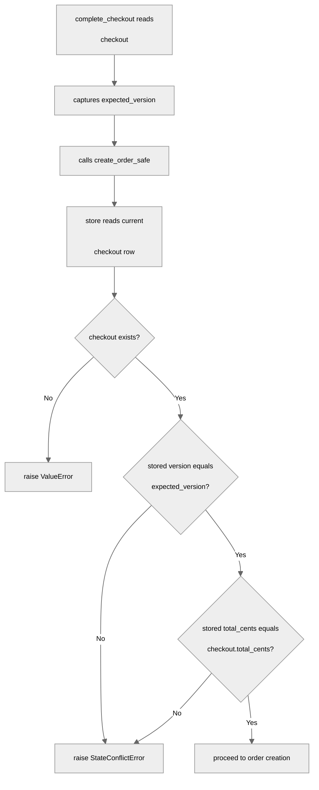

## Figure 13.2

```mermaid
%%{init: {"theme": "neutral", "themeVariables": {"fontFamily": "Arial, Helvetica, sans-serif", "fontSize": "11px", "actorFontSize": "11px", "noteFontSize": "10px", "messageFontSize": "10px"}}}%%flowchart TD
    READ["complete_checkout reads

checkout"] --> CAP["captures expected_version"]
CAP --> CALL["calls create_order_safe"]
CALL --> STORE_READ["store reads current


checkout row"]

STORE_READ --> EXISTS{"checkout exists?"}

EXISTS -->|"No"| ERR_VAL["raise ValueError"]
EXISTS -->|"Yes"| VER_CHECK{"stored version equals

expected_version?"}

VER_CHECK -->|"No"| ERR_CONFLICT["raise StateConflictError"]
VER_CHECK -->|"Yes"| TOTAL_CHECK{"stored total_cents equals

checkout.total_cents?"}

TOTAL_CHECK -->|"No"| ERR_CONFLICT
TOTAL_CHECK -->|"Yes"| PROCEED["proceed to order creation"]

```
