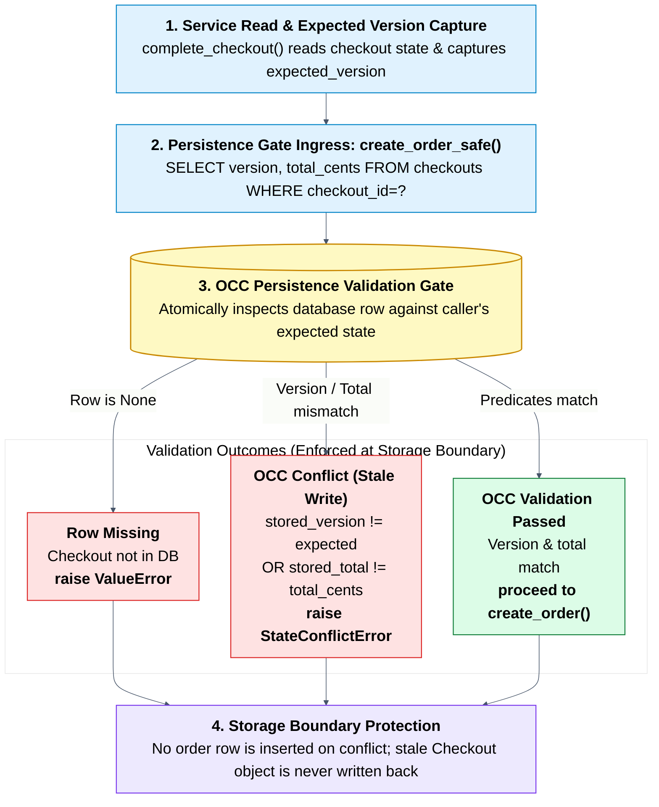

## Figure 13.2: OCC validation gate at the persistence boundary.

```mermaid
%%{init: {"theme": "base", "themeVariables": {"fontFamily": "Arial, Helvetica, sans-serif", "fontSize": "24px", "primaryColor": "#F8FAFC", "primaryBorderColor": "#0284C7", "primaryTextColor": "#000000", "lineColor": "#475569"}}}%%
flowchart TD
    A["<div style='min-width: 600px;'><b>1. Service Read & Expected Version Capture</b><br/>complete_checkout() reads checkout state & captures expected_version</div>"]

    B["<div style='min-width: 600px;'><b>2. Persistence Gate Ingress: create_order_safe()</b><br/>SELECT version, total_cents FROM checkouts WHERE checkout_id=?</div>"]
    A --> B

    Gate[("<div style='min-width: 600px;'><b>3. OCC Persistence Validation Gate</b><br/>Atomically inspects database row against caller's expected state</div>")]
    B --> Gate

    subgraph Outcomes ["Validation Outcomes (Enforced at Storage Boundary)"]
        direction LR
        Missing["<div style='min-width: 210px;'><b>Row Missing</b><br/>Checkout not in DB<br/><b>raise ValueError</b></div>"]
        Conflict["<div style='min-width: 240px;'><b>OCC Conflict (Stale Write)</b><br/>stored_version != expected<br/>OR stored_total != total_cents<br/><b>raise StateConflictError</b></div>"]
        Success["<div style='min-width: 210px;'><b>OCC Validation Passed</b><br/>Version & total match<br/><b>proceed to create_order()</b></div>"]
    end

    Gate -->|"Row is None"| Missing
    Gate -->|"Version / Total mismatch"| Conflict
    Gate -->|"Predicates match"| Success

    Final["<div style='min-width: 600px;'><b>4. Storage Boundary Protection</b><br/>No order row is inserted on conflict; stale Checkout object is never written back</div>"]

    Missing --> Final
    Conflict --> Final
    Success --> Final

    classDef service fill:#E0F2FE,stroke:#0284C7,color:#000000,stroke-width:1.5px
    classDef gate fill:#FEF9C3,stroke:#CA8A04,color:#000000,stroke-width:2px
    classDef error fill:#FEE2E2,stroke:#DC2626,color:#000000,stroke-width:1.5px
    classDef success fill:#DCFCE7,stroke:#15803D,color:#000000,stroke-width:1.5px
    classDef final fill:#EDE9FE,stroke:#7C3AED,color:#000000,stroke-width:1.5px

    class A,B service
    class Gate gate
    class Missing,Conflict error
    class Success success
    class Final final
```
