# UCP Agent Architecture & Integrity Design

This document visualizes the architectural patterns used to guarantee payment integrity and state consistency in the Universal Commerce Protocol (UCP) Agent.

## 1. Deployment Topology (Multi-Worker)

Illustrates why in-memory locks fail and why we enforce safety at the Persistence Layer.
- **Blue Arrows:** Concurrent race attempts.
- **Green Arrow:** The successful write (Winner).
- **Red Dashed Arrows:** Rejection signals (Losers) due to Version Conflict or Unique Constraint.

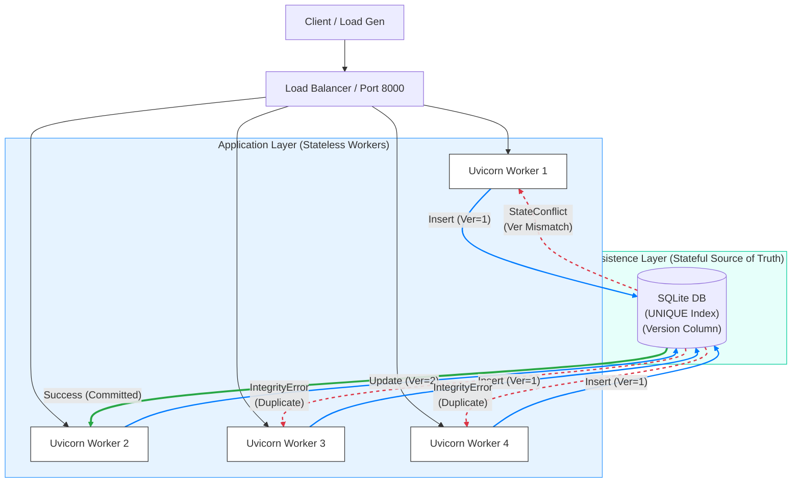

---

## 2. Retry Storm Sequence (Payment Integrity)

Shows how the Database Unique Constraint acts as the "Atomic Guard" against duplicate payments (Double Spend).

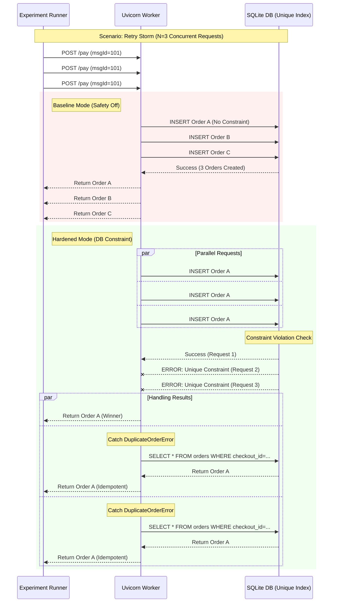

---

## 3. Mutation Race Sequence (Optimistic Concurrency)

Shows how Versioning (OCC) detects dirty reads when an "Add Item" request interleaves with a "Payment" request.

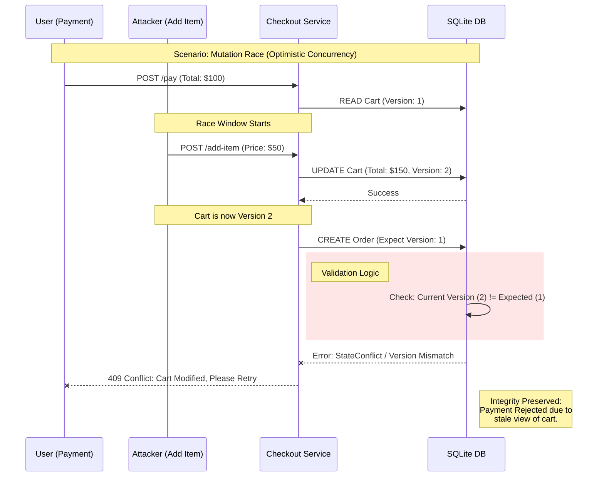

---

## 4. Payment Integrity Guard Logic (Flowchart)

The decision tree for handling incoming requests safely.

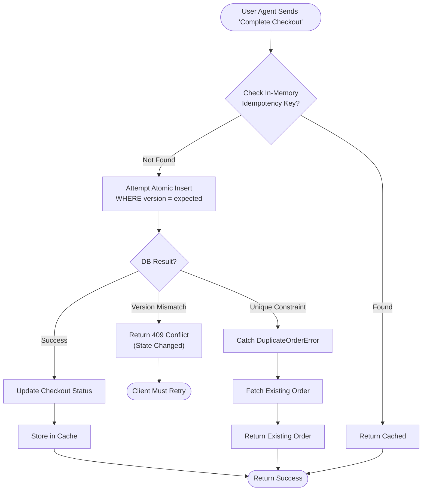

---

## 5. State Diagram (Order Lifecycle)

Formalizing the idempotent state transition: "Failure to Create" is a valid path to "Success".

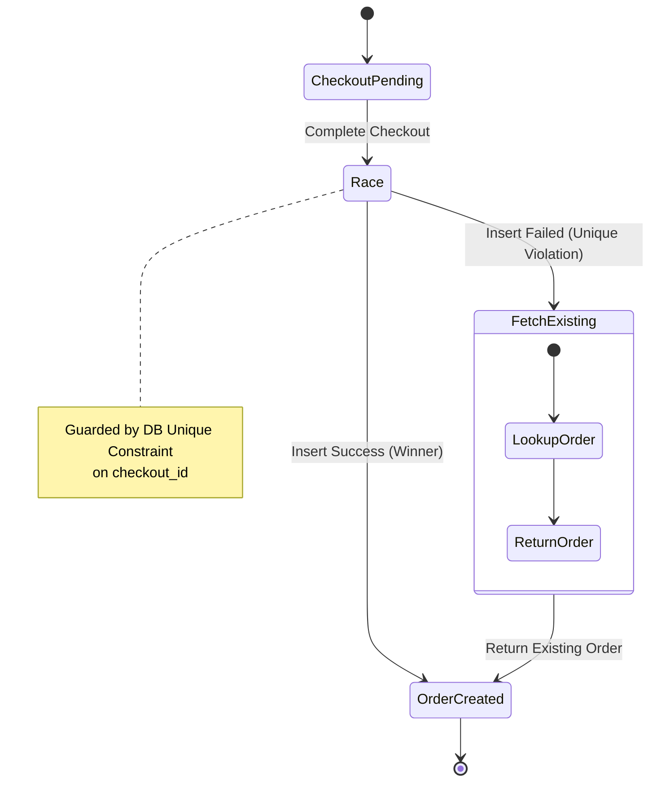

---

## 6. Conflict Recovery After OCC Rejection

Shows the post-conflict path after a stale write is rejected: the payment attempt arrives with an expected checkout version, the persistence layer detects that storage has advanced, the write fails with a conflict, and the caller must refetch current state before retrying or asking for reconfirmation.

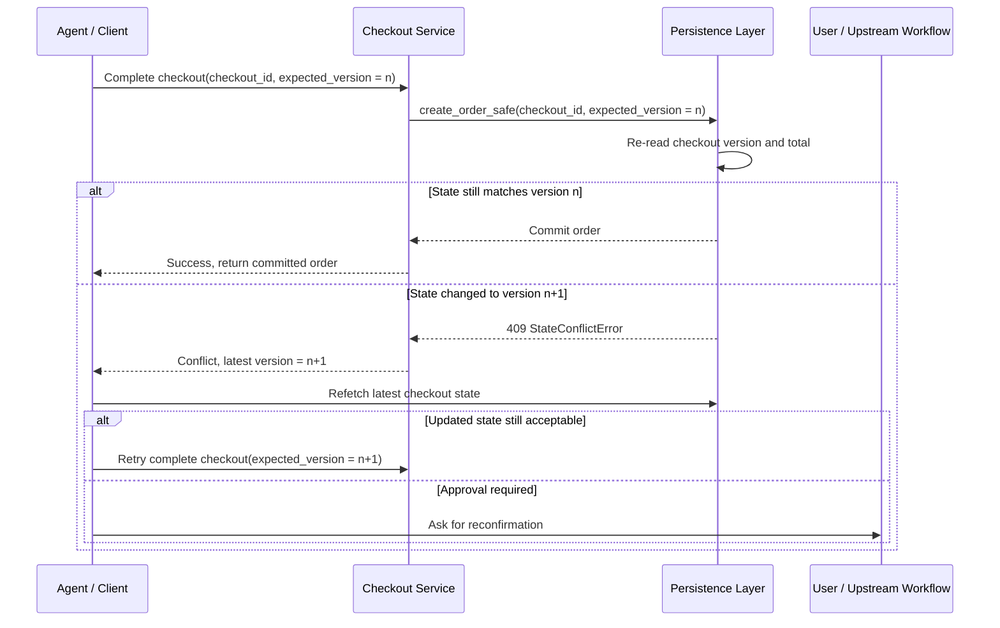

---

## 7. Retry-safe checkout completion across concurrent workers.
Stable request identity distinguishes repeated delivery from new intent, a durable idempotency ledger records the winning business action, and the database uniqueness rule on orders(checkout_id) ensures that concurrent writers converge on one committed order.

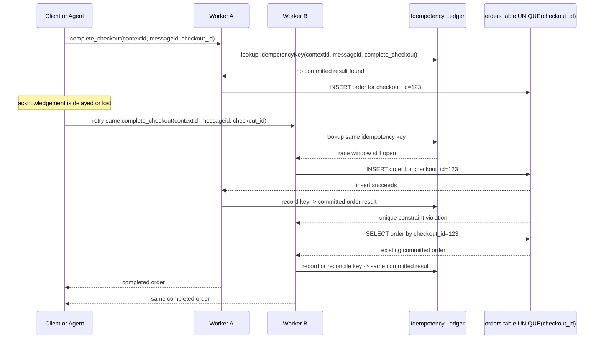

---

## 8. Fast path versus atomic slow path. 
Early idempotency lookup and in-memory locking can intercept likely duplicates, but only the database unique constraint on orders(checkout_id) settles the race across workers. The winning request commits the order, and the losing request re-reads that canonical row and returns the same business result. 

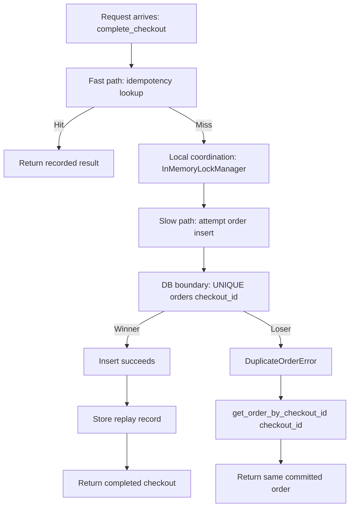

---

## 9. The schema settles the race. 
Advisory replay checks may detect likely duplicates early, but the unique index on orders(checkout_id) is the shared enforcement point that allows one committed order row and forces the loser to reconcile by re-reading the canonical order.

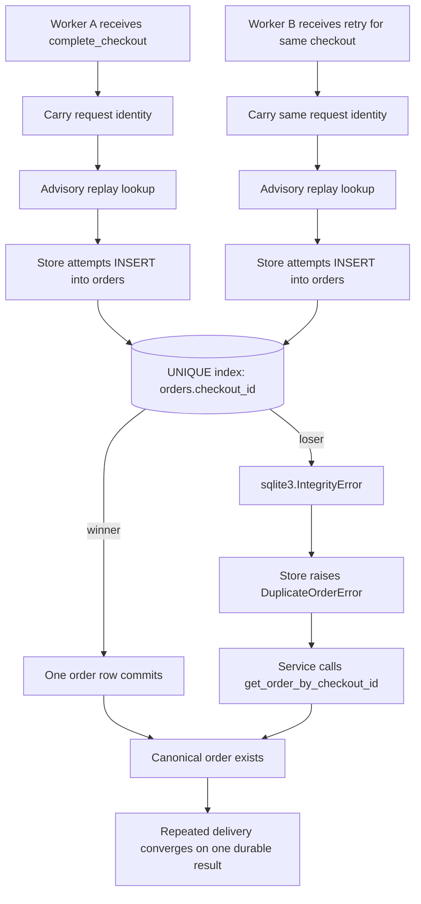

---

## 10. Commit authority stays below the model boundary. 
The model may select complete_checkout, and local replay checks may reduce duplicate work, but only the database commit boundary can decide whether a new order is created or a duplicate must reconcile to the canonical row.

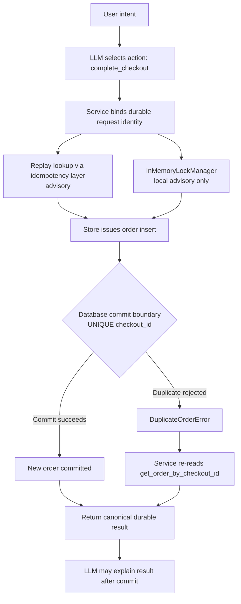

---

## 11. Checkout version lifecycle. 
A payment attempt begins from one persisted checkout version. If another actor mutates the checkout before commit, the version advances and the original payment attempt becomes stale. The order path must compare the caller's last-seen version with storage before creating the order.

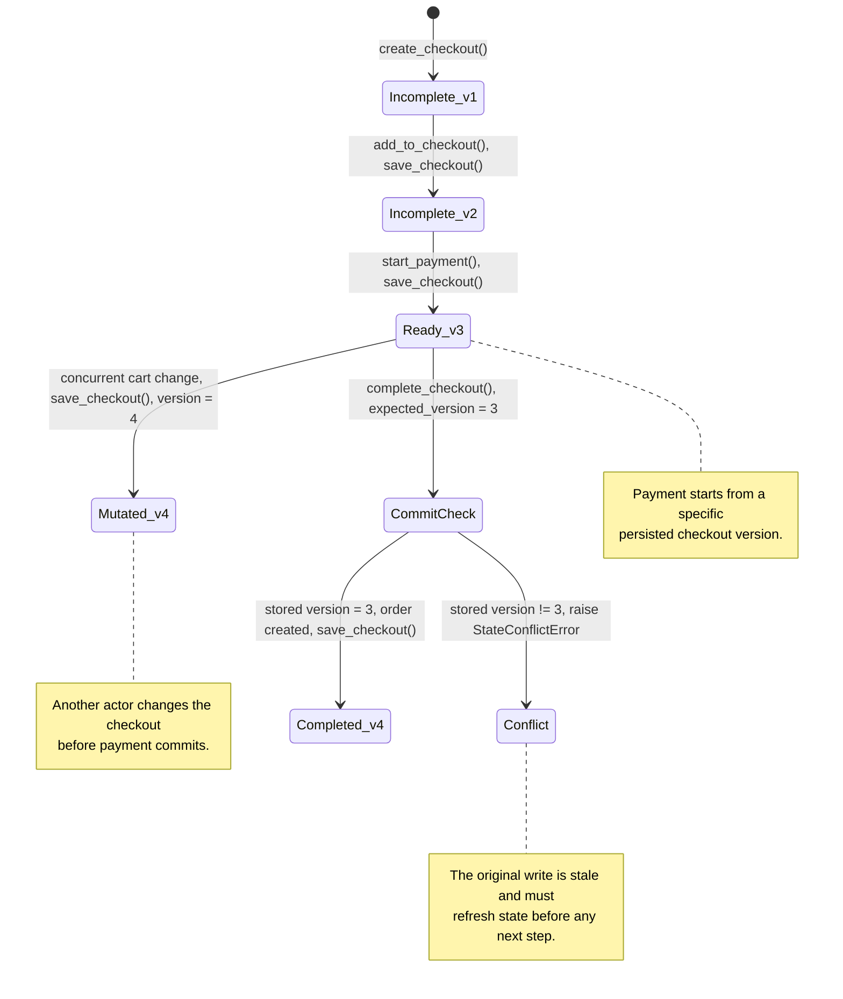

##12. Persistence-boundary validation in the repository

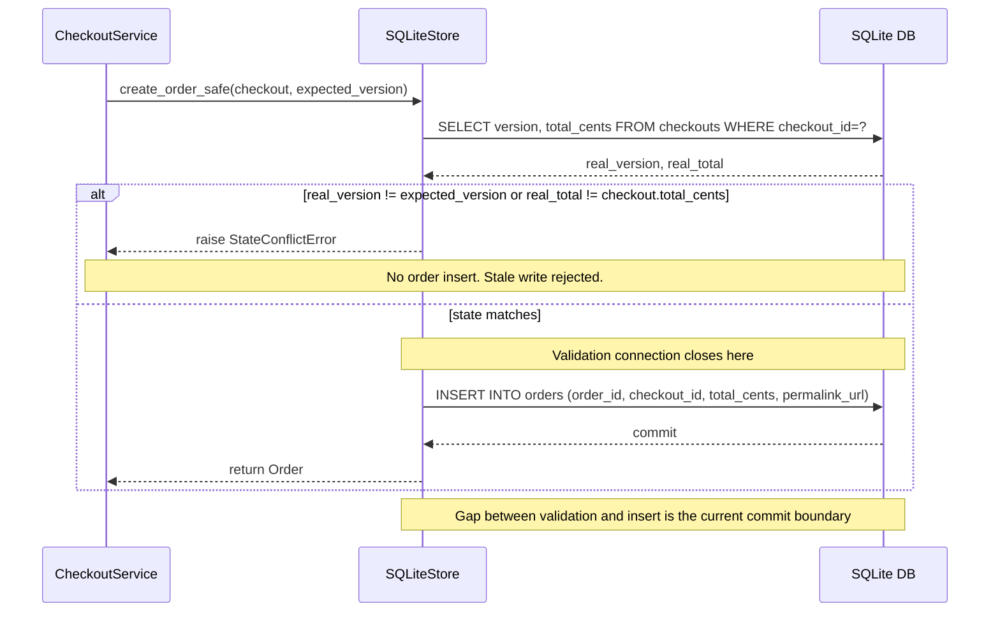
